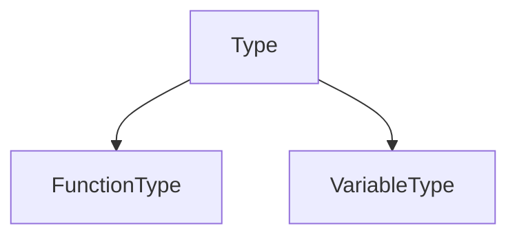

# Analyse sémantique

## Table des symboles

Pour stocker les informations sur les variables et fonctions existantes au cours du programme,
le `checker` utilise un `SpaghettiStack` générique. Il permet de stocker des
informations en fonction du contexte. La généricité permet dans la suite de définir
nous même les classes que l'on peut utiliser. Dans notre cas :

Dans les 2 cas, le numéro de ligne est stocké pour pouvoir afficher des erreurs précises.

---

Lors de la validation sémantique du programme, on s'intéresse aux points suivants :

## Existence des symboles

Lors d'une assignation, il faut vérifier que le symbole de droite existe.
Sinon, on throw une exception détaillée de l'erreur.
Il y a plusieurs cas sur le type du symbole de droite :

### 1. Variable
Si la variable de droite est une variable, on regarde si elle existe dans la table des symboles,
et qu'elle est définie comme type variable

### 2. Fonction
Si c'est une fonction, on regarde si elle existe dans la table des symboles et que son type
est une fonction. Si la fonction prend des arguments, alors il faut également vérifier ces symboles.

## Nombres d'arguments d'une fonction

Lors de la définition d'une fonction dans le langage, la table des symboles stock les informations suivantes :
- Nombre d'arguments en entrée
- Nom
- Nombre de sorties

Ces informations sont utiles lors de la vérification de l'appel d'une fonction. 
Effectivement, il faut compter le nombre d'arguments lors d'un appel et vérifier que
cela correspond aux informations stockées dans la table des symboles.

Il faut également vérifier que le nombre de sorties d'une fonction correspond au nombre de variables
renseigné sur la gauche de l'assignation.

## Existence de la fonction main
Le langage _While_ n'autorise pas d'écrire en dehors des fonctions. Nous avons donc besoin
d'un point d'entre à notre programme afin de pouvoir exécuter certaines actions.

Le nombre d'arguments précisé dans la fonction main défini le nombre d'arguments nécessaires
au lancement du programme final dans le terminal.