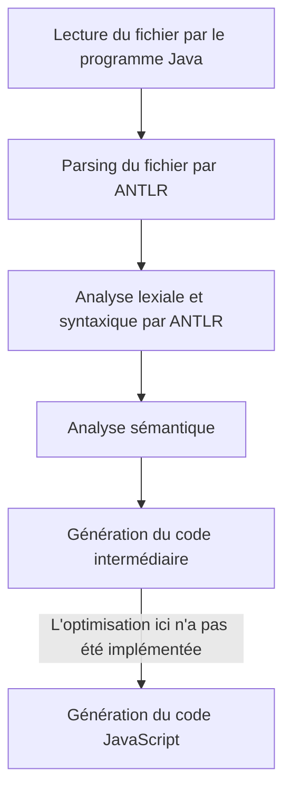
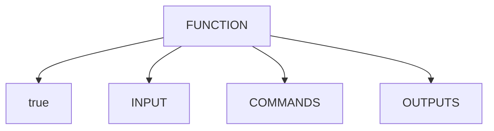
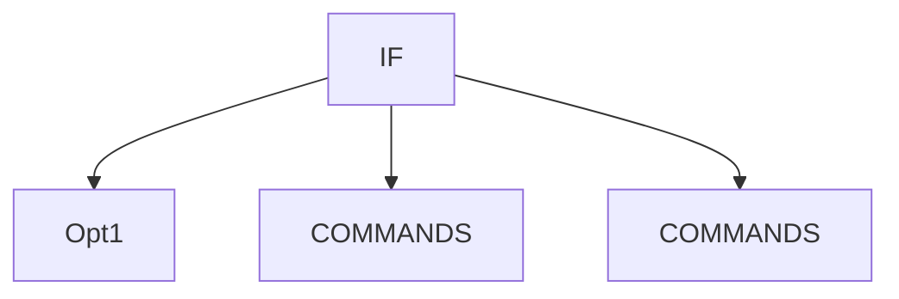
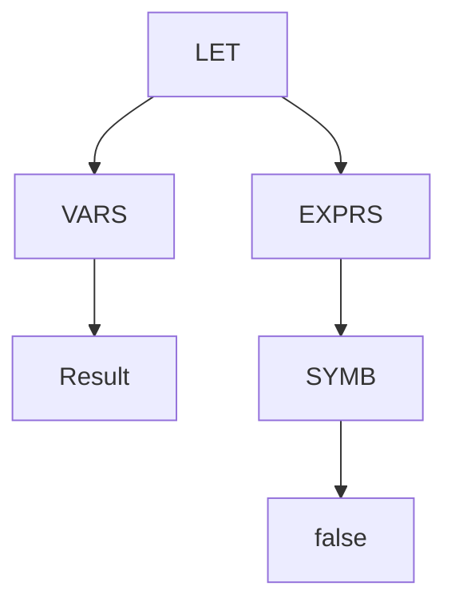

# Description technique

## Description de l’architecture du compilateur et de la chaine de compilation depuis le code source en WHILE à la récupération d’un programme exécutable

Nous avons fait en sorte que cela soit facile à utiliser pour l'utilisateur. Le script prend en compte deux arguments. Le premier correspond au fichier d'entrée, le second au fichier de sortie.

## Description de l’AST

### Fonctions

Le noeud fonction comporte 4 noeuds :

- Le premier correspond au nom de la fonction.
- Le deuxième `INPUT` correspond aux paramètre d’entrée de la fonction
- Le troisième `COMMANDS` correspond au corps de la fonction
- Le dernier `OUTPUTS` correspond aux variables de sortie

### If

Le noeud `IF` comprend 3 noeuds :

- Le premier `Opt1` correspond à la condition d'exécution
- Les deux autres `COMMANDS` correspondent aux instructions à exécuter si la condition est vraie ou fausse.

### Let

Le noeud `LET` comprend 2 noeuds :

- Le premier `VARS` correspond aux variables qui seront affectées
- Le deuxième `EXPRS` correspond à l'expression dont la valeur sera affectée aux variables définies dans le noeud `VARS`.
