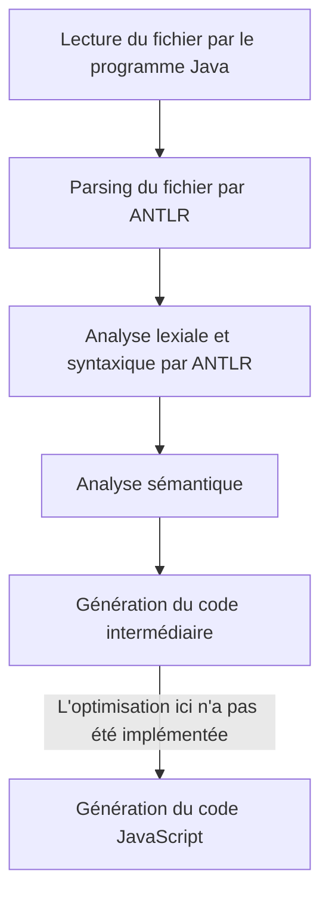
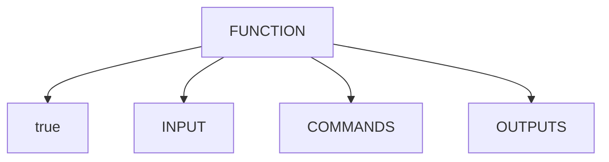
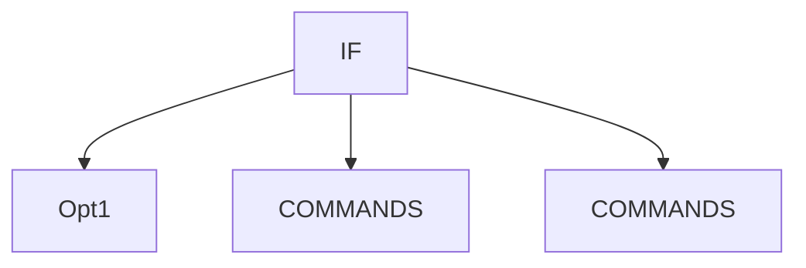
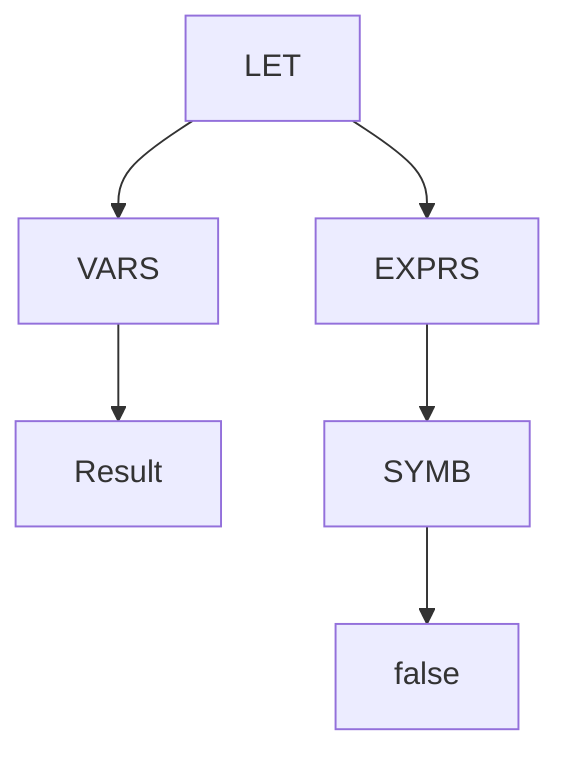
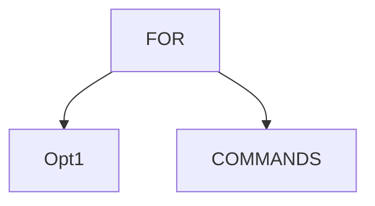
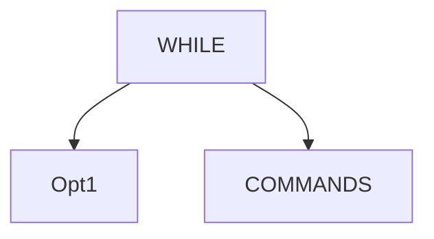
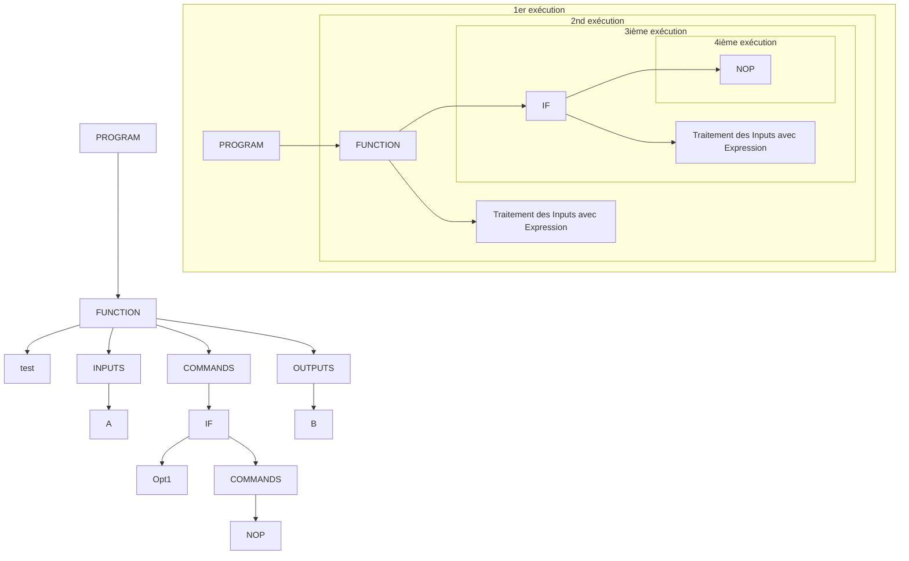

# Description technique

## Description de l’architecture du compilateur et de la chaine de compilation depuis le code source en WHILE à la récupération d’un programme exécutable

Nous avons fait en sorte que cela soit facile à utiliser pour l'utilisateur. Le script prend en compte deux arguments.
Le premier correspond au fichier d'entrée, le second au fichier de sortie.

## Description de l’AST

### Fonctions

Le noeud fonction comporte 4 noeuds :

- Le premier correspond au nom de la fonction.
- Le deuxième `INPUT` correspond aux paramètre d’entrée de la fonction
- Le troisième `COMMANDS` correspond au corps de la fonction
- Le dernier `OUTPUTS` correspond aux variables de sortie

### If

Le noeud `IF` comprend 3 noeuds :

- Le premier `Opt1` correspond à la condition d'exécution
- Les deux autres `COMMANDS` correspondent aux instructions à exécuter si la condition est vraie ou fausse.

### Let

Le noeud `LET` comprend 2 noeuds :

- Le premier `VARS` correspond aux variables qui seront affectées
- Le deuxième `EXPRS` correspond à l'expression dont la valeur sera affectée aux variables définies dans le
  noeud `VARS`.

### For

Le noeud `FOR` comprend 2 noeuds :

- Le premier `Opt1` correspond à l'expression de boucle
- Le deuxième `COMMANDS` correspond aux instructions à exécuter lors de chaque itération de la boucle.

### While

Le noeud `WHILE` comprend 2 noeuds :

- Le premier `Opt1` correspond à la condition d'exécution
- Le deuxième `COMMANDS` correspond aux instructions à exécuter lors de chaque itération de la boucle.

## Description de la génération de code 3 adresses à partir de l’AST

La génération de code 3 adresses à partir de l’AST se fait en utilisant un walker qui traverse l'AST. La génération est
basée sur une fonction récursive qui prend en paramètre un arbre et une liste de string. Les lignes de code 3 adresses
sont ajoutées au tableau qui correspond à tout le code 3 adresses résultat. Les fonctionnalités principales dont les AST
sont plus haut sont traitées séparément dans des classes différentes, comme les IF, les boucles FOR ou les FONCTIONS.

Pour cela, on utilise une classe `Expression` qui permet de désigner une expression qui peut être utilisée dans une
variable ou une boucle. Cette classe permet de décomposer une expression en ses sous-expressions afin de générer le code
3 adresses correspondant.

Par exemple, on retrouve le fil d’exécution du convertisseur dans le graphique ci-dessous :

### Description de l’optimisation de code si elle a été réalisée

L’optimisation de code n’a pas été réalisée.

### Description de la bibliothèque runtime de WHILE écrite dans le langage cible

La runtime Javascript de notre compilateur WHILE est très légère. Elle permet de convertir un tableau en entier, booléen
et chaîne de caractères avec `toInt()` et `toBool()`. Elle permet également de print des tableaux en fonction de leur
type et de naviguer dans un tableau avec `tl()` et `hd()`. On utilise aussi un bout de code javascript qui permet de
récupérer les arguments avec lequel le programme est exécuté. Ces arguments sont ensuite envoyés à la fonction `main` du
programme WHILE.
